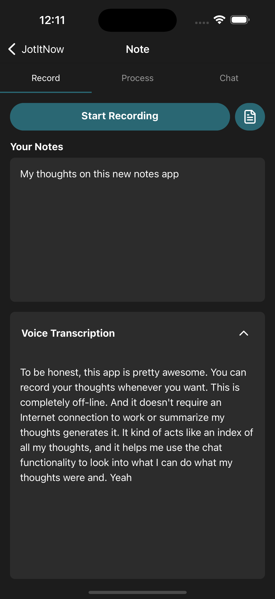
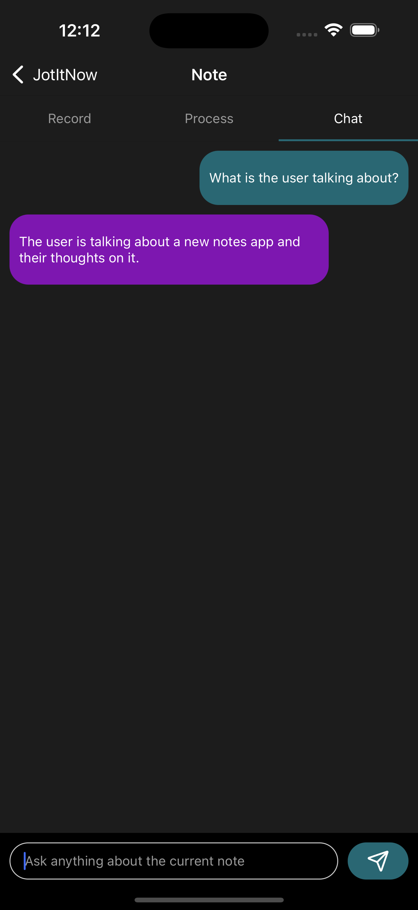

# JotItNow

<p align="center">
  
</p>

> The ultimate note-taking app that combines powerful features with complete privacy.

JotItNow is a powerful note-taking application that works entirely offline, ensuring complete privacy and security for your thoughts and ideas. Whether you're recording voice memos, writing down notes, or generating summaries, JotItNow makes it seamless – and it all works without an internet connection.

IOS only

## 🌟 Key Features

- **Voice + Text Integration**: Record voice notes and jot down text notes simultaneously, keeping everything in sync.
- **Intelligent Summarization**: Instantly generate summaries for long voice memos or text notes, saving you time and effort.
- **Interactive Chat**: Ask questions and explore your notes with an intuitive chat interface that understands your content – all offline!
- **100% Privacy**: No internet connection needed, ensuring complete privacy and no data tracking.
- **Open Source & Free**: JotItNow is free to use and open source.

## 📱 Screenshots

<p align="center">
  
  
  
</p>

## 🚀 Getting Started

### Prerequisites

- iOS 15.0+ / macOS 12.0+
- Xcode 13.0+
- Swift 5.5+

### Installation

1. Clone the repository:
   ```bash
   git clone https://github.com/navedmerchant/JotItNow.git
   ```

2. Build and run the application on your device or simulator.
   ```
   npx react-native run-ios
   ```

## 🛠️ Technical Details

JotItNow uses on-device machine learning to provide features like voice transcription, summarization, and chat capabilities without requiring an internet connection. This ensures your data never leaves your device.

### Core Technologies

- Apple Speech Recognition for Voice Transcription
- Llama.rn for running the model
- Sqlite-vec for vector search
- BGE for generating embeddings

## 🤝 Contributing

Contributions are welcome! If you'd like to contribute to JotItNow, please follow these steps:

1. Fork the repository
2. Create a new branch (`git checkout -b feature/amazing-feature`)
3. Make your changes
4. Commit your changes (`git commit -m 'Add some amazing feature'`)
5. Push to the branch (`git push origin feature/amazing-feature`)
6. Open a Pull Request

Please make sure to update tests as appropriate and adhere to the existing coding style.

## 📄 License

This project is licensed under the MIT License - see the [LICENSE](LICENSE) file for details.

## 📞 Contact

If you have any questions or suggestions, feel free to open an issue or contact the maintainers.

---

<p align="center">
  Made with ❤️ by Naved Merchant
</p>
